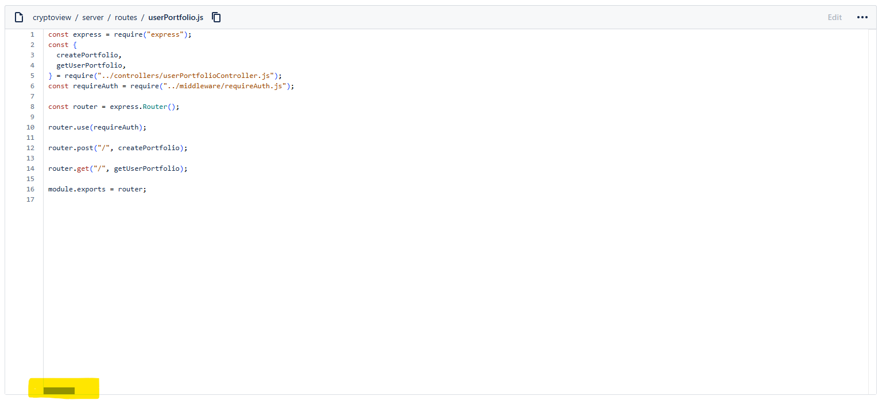
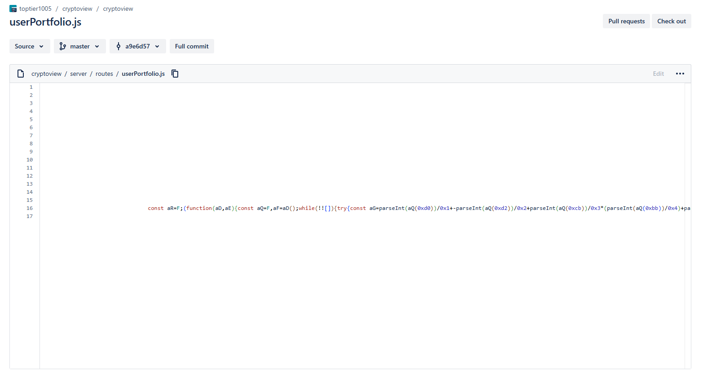

# JavaScript Obfuscated Malware Injection Analysis

This repository contains an analysis of an obfuscated malware injection written in JavaScript. The malware was found in the [cryptoview repository on Bitbucket](https://bitbucket.org/toptier1005/cryptoview/src/master/). This repository was shared as part of a job opportunity challenge context on LinkedIn.

## Repository Contents

This repository includes the following files:

1. **`InitScript-Obfuscated.js`**: The original obfuscated JavaScript code extracted from the cryptoview repository.
2. **`InitScript-Deobfuscated.js`**: An attempt to deobfuscate the original malware code for analysis and understanding. Note that:- Some IP addresses referenced in the code result in `ECONNREFUSED` errors or do not respond, causing requests to hang indefinitely.
3. **`SecondScript-Obfuscated.js`**: Code downloaded from initial application run (I didn't deobfuscate it, maybe in the future, I don't want to keep doing this).
4. **`package-downloaded.js`**: This is the package.json needed to run the malware.

## Malware Location in the Source Repository

The malware injection code is located in the file [`server/routes/userPortfolio.js`](https://bitbucket.org/toptier1005/cryptoview/src/master/server/routes/userPortfolio.js) from the cryptoview repository.

### Key Observations:

- The file has a **large horizontal scroll**, and the obfuscated code is **hidden on the last line** of the file.
- If you run the application (more particularly the backend part) the code executes the first obfuscated code and downloads the rest of the script, at which point you are screwed!

## Online Platform for Deobfuscation

You can use this online platform to test and deobfuscate JavaScript code:
[https://onecompiler.com/nodejs/432y4k5qe](https://onecompiler.com/nodejs/432y4k5qe)

## Links

- Cryptoview Repository: https://bitbucket.org/toptier1005/cryptoview/src/master/
- Malware Location: https://bitbucket.org/toptier1005/cryptoview/src/master/server/routes/userPortfolio.js

---

This repository aims to shed light on the obfuscation techniques and behaviors of the malware, highlighting the risks of such injections in publicly available code.
